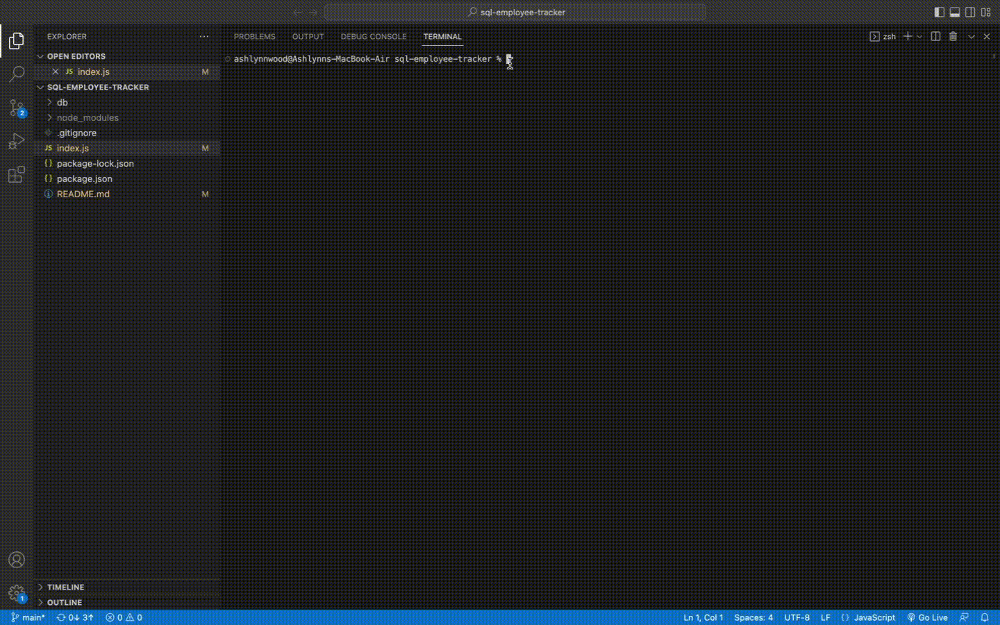

# sql-employee-tracker

  ## Preview
  

  ## Description
  This project was designed to be a content management system for a company's employee database. It allows users to quickly and easily interact with the database to view and update employee information and organize their business via command line prompts.

  ## Table of Contents
  * [Installation](#installation)
  * [Usage](#usage)
  * [License](#license)
  * [Contributing](#contributing)
  * [Tests](#tests)
  * [Questions](#questions)
  
  ## Installation
  To use this employee tracker, you will need to install node.js, inquirer@8.2.4, and mysql2@2.2.5. To install necessary dependencies in node, run the following command: 
  npm i

  ## Usage
  After installation, user can run node index.js in the terminal. This will provide the user with a series of prompts for user input, starting with the main prompt asking the user what they would like to do. A user can choose to view all employees, view all roles, view all departments, add an employee, add a role, add a department, or update an employee's role. Further prompts will appear asking for more information from the user depending on what they chose. The user can type in their input for each question and hit enter, which will take them to the next question. Once they have completed all of the questions for that section, they will be redirected to the main prompt again. After adding anything new to the database, when the user clicks "view all __" again, their new input will be included. Once the user is done viewing and adding, they can select the option to quit, which will exit the application.

  ## License
  This project is licensed under the MIT.

  ## Contributing
  To contribute to this project, gitfork.

  ## Tests
  No testing at this time.

  ## Questions 
  If you have any questions about the repo, open an issue or 
  contact me directly at ashlynnnwood@gmail.com. You can find more of my work at https://github.com/ashlynnwood.